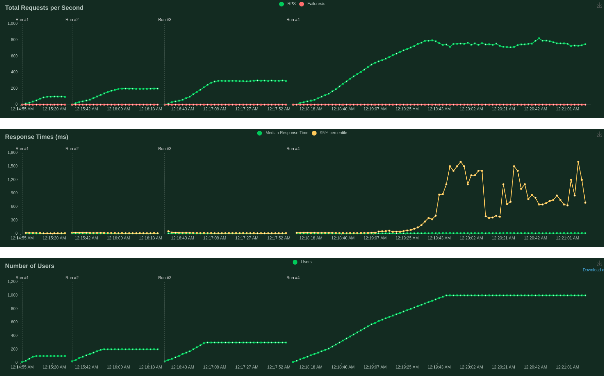
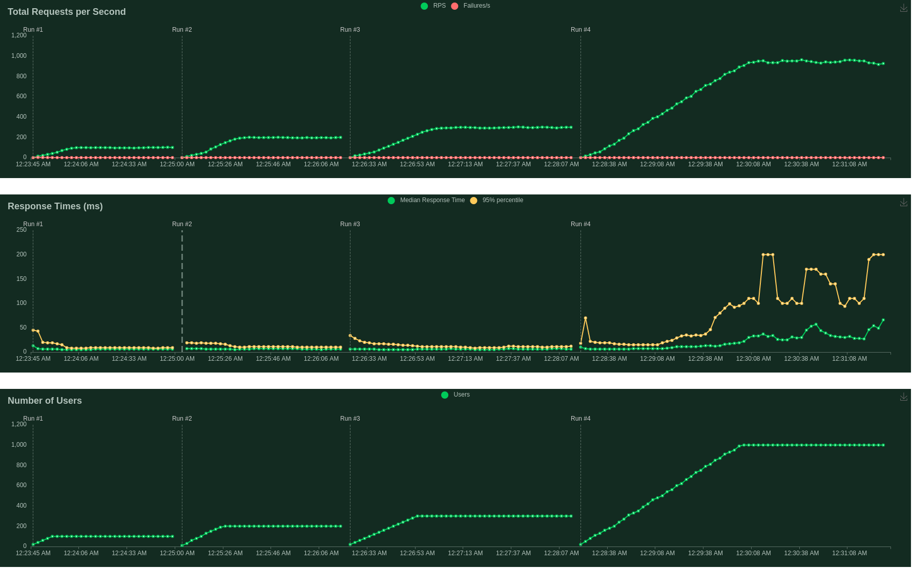
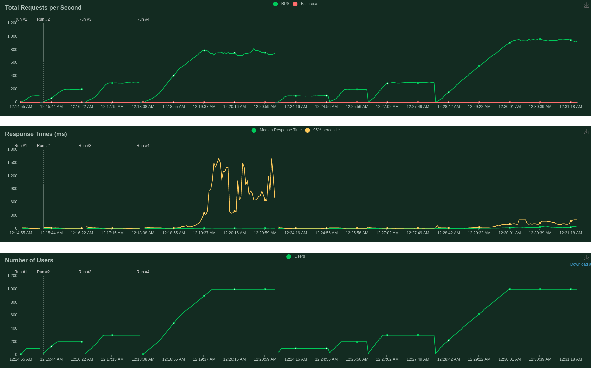

# Questions 

Question from 1-5 can be obtained using `questions.sh` and the answers are stored in `questions.txt` 

The answers are: 
- Q1:bentoml, version 1.0.7
- Q2: credit_risk_model:7thh5rcqowstv3jy    bentoml.xgboost  197.77 KiB  2022-10-20 14:52:00 
- Q4: Version of    scikit-learn: 1.1.1                                                                       
- Q5: Response : [1]

### Question 3

```python
from pydantic import BaseModel, StrictStr 

class UserProfile(BaseModel):
    name: StrictStr
    age: int 
    country: StrictStr
    rating: float
```


### Question 6 

Answer: Model 2.

Here, I ramped up the users as follows: 100, 200,300 and 1000. This was done for both models.

Monitoring performance of the first model 



Monitoring performance of the second model 


The figure below shows the performed tests for both models. The first 4 runs correspond to the first model and the next 4 to the second. 



The following code allows to understand why the second model outperformed the first one. It turns out that the second model allows to use batching, thus, optimizing the service.


```python
In [1]: model1_ref = bentoml.sklearn.get("mlzoomcamp_homework:qtzdz3slg6mwwdu5")

In [2]: model2_ref = bentoml.sklearn.get("mlzoomcamp_homework:jsi67fslz6txydu5")

In [3]: model1_ref.info.signatures
Out[3]: {'predict': ModelSignature(batchable=False, batch_dim=(0, 0), input_spec=None, output_spec=None)}

In [4]: model2_ref.info.signatures
Out[4]: {'predict': ModelSignature(batchable=True, batch_dim=(0, 0), input_spec=None, output_spec=None)}
```

### Question 7

